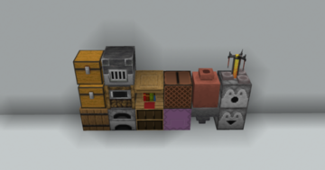
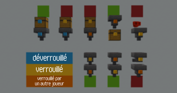

# BenJ Plugin

Plugins Minecraft 1.20.4 sous PaperMC développés par **BenJ4368** 
pour la communauté du serveurdedart.fr ([Dart](https://www.youtube.com/@darteuh), [Discord](discord.gg/dart)).

## Liste des plugins

- `ChatMentioner` : Joue un son à un joueur quand mentionné.
- [en cours] `ChunkClaimer` : Permet la protection du terrain.
- `ChestLocker` : Permet le verrouillage des conteneurs.

### 💬 ChatMentioner

  Averti le joueur avec un son lorsque son pseudo est mentionné dans le chat. 
  ChatMentioner est activé par défaut, mais peux être desactiver : 
  `/chatmentionner <on | off>` 
  Une mention qui proviens d'un modérateur outrepasse ce paramètre, et le son en est différent. 

### [en cours] 🛡️ ChunkClaimer

  Permet la protection du terrain et previens les interactions non autorisés.
  `/chunkclaimer <claim | unclaim | add | remove | check>`

### 🔒 ChestLocker
  Permet le verrouillage, déverrouillage, ajout et retrait de droits sur conteneurs via des clés. 
  `/chestlocker <lock | unlock | add | remove | check>` 

  Les clés 🔑 ne sont utilsable dans aucunes recettes de fabrication. 
  Les clés 🔑 ne sont pas droppable, et les Piglins 🐽 ne les échangent pas 
  Un conteneur verrouillé ne peux être détruis ni par un joueur, ni par une explosion 💥. 
  Un itemframe posé sur un conteneur verrouillé est également verrouillé.
  Aucun bloc n'est cassable si le joueur tiens une clé 🔑, pour éviter la destruction des conteneurs en créatif, et des DecoratedPot en survie. 

  **Les conteneurs verrouillable sont:** 

  

  **Les interactions comprenant au moins un conteneur verrouillé sont limitées. En voici le details:** 

  

## 🧑‍💻 Développement

- Build tool : **Maven**
- Java 17+
- [BenJ4368](https://github.com/BenJ4368) — Développement principale
