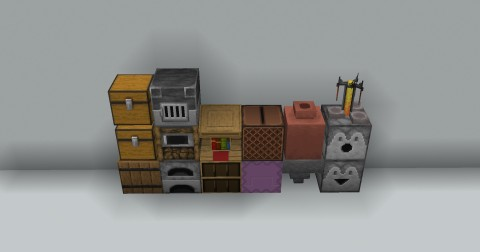

# BriochePlugin

Un plugin Minecraft Paper 1.20.4 développé par **BenJ4368** pour la communauté du serveurdedart.fr ([Discord](discord.gg/dart
), [Dart](https://www.youtube.com/@darteuh)).

## 🧠 Modules

- `chatMention` : Gestion des mentions et du son joué.
- `chestLocker` : Gestion du verrouillage des coffres et conteneurs.

## ✨ Fonctionnalités actuelles

- **chatMention**: 
	Averti le joueur avec un son lorsque son pseudo est mentionné dans le chat. 
	Aucun son n'est joué si le joueur se mentionne lui-même.

- **(En cours) chestLocker**: 
  Permet le verrouillage, déverrouillage, ajout et retrait de droits sur conteneurs via des clés. 
  `/chestlock <lock | unlock | add | remove>` 

  Un conteneur verrouillé ne peux être détruis ni par un joueur, ni par une explosion. 

  Les "conteneurs" verrouillable sont: 
  

## 🧑‍💻 Développement

- Plugin principal : `me.benj.brioche.BriochePlugin`
- Version du plugin: `1.0-SNAPSHOT`
- Build tool : **Maven**
- Java 17+

## 🔗 Auteurs

- [BenJ4368](https://github.com/BenJ4368) — Développement initial
