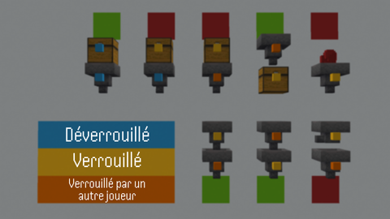

# BriochePlugin

Un plugin Minecraft 1.20.4 sous PaperMC développé par **BenJ4368** 
pour la communauté du serveurdedart.fr ([Discord](discord.gg/dart), [Dart](https://www.youtube.com/@darteuh)).

## 🧠 Modules

- `chatMention` : Gestion des mentions et du son joué.
- `chestLocker` : Gestion du verrouillage des coffres et conteneurs.

### 💬 ChatMention

  Averti le joueur avec un son lorsque son pseudo est mentionné dans le chat. 
  Aucun son n'est joué si le joueur se mentionne lui-même. 

### 🔒 ChestLocker
  Permet le verrouillage, déverrouillage, ajout et retrait de droits sur conteneurs via des clés. 
  `/chestlock <lock | unlock | add | remove | check>` 

  Les clés 🔑 ne sont utilsable dans aucunes recettes de fabrication. 
  Les clés 🔑 ne sont pas droppable, et les Piglins 🽠ne les échangent pas 
  Un conteneur verrouillé ne peux être détruis ni par un joueur, ni par une explosion 💥. 
  Aucun bloc n'est cassable si le joueur tiens une clé 🔑, pour éviter la destruction des conteneurs en créatif, et des DecoratedPot en survie. 

  **Les conteneurs verrouillable sont:** 

  

  **Les interactions comprenant au moins un conteneur verrouillé sont limitées. En voici le details:** 

  

## 🧑‍💻 Développement

- Plugin principal : `me.benj.brioche.BriochePlugin`
- Version du plugin: `1.0-SNAPSHOT`
- Build tool : **Maven**
- Java 17+

## 🔗 Auteurs

- [BenJ4368](https://github.com/BenJ4368) — Développement initial
